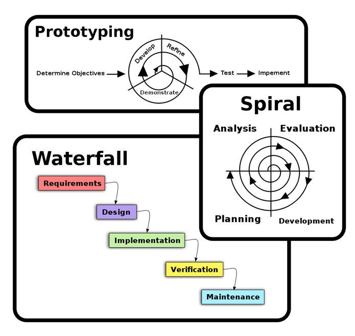
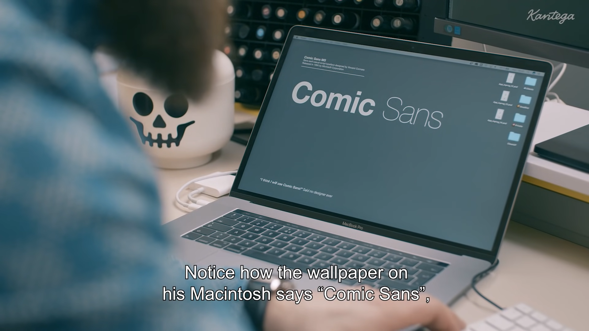

 

# **Welcome to CS571!**
## Building User Interfaces

 

#### Cole Nelson

---

What is this course about?

 

# UX Development

 

 ...but what is UX Development?

---

The realm of the UX developer exists <b>somewhere between that of the traditional developer and the designer</b>. We’re not really designers, yet to be a good UX developer you certainly need to have an eye for design. In the same vein, we’re not traditional developers but we certainly need to have development experience and expertise. Often this experience spans multiple technologies, languages, and platforms.

 ###

 — Tim R. Todish

---

It falls on <b>the UX developer to bridge the gap between design and technology</b>. We need to be able to think and speak the language of designers. It’s our job to help translate their vision to the development team in a way that they can understand and accept. This can be a critical piece of the puzzle in a project, especially if the design and the interactions behind it are complex.

###

 — Tim R. Todish

---

Similarly, we need to speak on behalf <b>the developers to help reign in the designers</b>, at times. If they are coming up with concepts that will be extremely difficult or time consuming to implement, we can explain the limitations of the technology and the complexity involved in implementing their designs, and try to come up with an acceptable alternative.

###

 — Tim R. Todish

---

# **UX Development**
## = Software Engineering +
## UX Design

---

# What does a **Software Engineer** do?

---

[Kantega | The Mysterious Life of Developers](https://www.youtube.com/watch?v=ocwnns57cYQ)

---

<b>Definition:</b> A software engineer is a person who applies the principles of software engineering to the design, development, maintenance, testing, and evaluation of computer software.

What are the principles of software engineering?

[What is a Software Engineer?](https://en.wikipedia.org/wiki/Software_engineer)

---

### Principles of Software Engineering

1. Separation of concerns
2. Modularity
3. Abstraction
4. Anticipation of change
5. Generality
6. Incremental development
7. Consistency

[Principles of Software Engineering](https://www.d.umn.edu/~gshute/softeng/principles.html)

---

### Software Development Lifecycle

[SDL Process](https://en.wikipedia.org/wiki/Software_development_process)

---

# What does a **UX Designer** do?

---

[Kantega | The Mysterious Life Of UX Designers](https://www.youtube.com/watch?v=gfHcnig8Lo4)

---

<b>Definition:</b> User experience (UX) design is the process that design teams use to create products that provide meaningful and relevant experiences to users.  A UX designer is concerned with the entire <i>process</i> of acquiring and integrating a product, including aspects of branding, design, usability, and function.

###

What are the steps in UX Design?

###
[Interaction Design Foundation](https://www.interaction-design.org/literature/topics/ux-design)

---

### UX Design Process
Look familiar?

[NN/g Design Thinking](https://www.nngroup.com/articles/design-thinking/)

---

# So then, what is **UX Development**?

---

[Don Norman: The term "UX"](https://www.youtube.com/watch?v=9BdtGjoIN4E&t=9s)

---

<h3>UX Development Trajectories</h3>

 - One-person development team to build full-stack applications
 - A developer who speaks the language of the designers
 - A designer who can also build native prototypes
 - A bridge/translator between designers and developers in large/complex organizations

---

# Course Logistics

---

### Cole Nelson
**ctnelson2@wisc.edu**

Professional Interests
 * Computer Science Education
 * Human-Computer Interaction
 * Web Application Security

###

Personal Interests
 * Coffee

 

---

### Nithin Weerasinghe
**nithinlw@cs.wisc.edu**

Professional Interests:
 * Computational Social Science
 * Artificial Intelligence
 * Cognitive Science

Personal Interests:
 * Podcasts
 * Board games

---

<h3>Course Information</h3>

 - Meet every Tuesday 5:30 - 8:30 pm @ EPIC
 - First half of lecture will cover programming topics, second half fundamental human-computer interaction. Small lab & break in-between.
 - PowerPoint slides, code snippets, and other supplemental materials will be uploaded to Canvas.
- Bring a laptop!

---

| Date    | Topics                                     | Homework    | Quiz    |
|---------|--------------------------------------------|-------------|---------|
| Sept 13 | JavaScript 1 & Design Thinking             | Assign HW1  | Quiz A  |
| Sept 20 | JavaScript 2 & Prototyping                 | Assign HW2  | Quiz B  |
| Sept 27 | React 1 & Visual Design                    | Assign HW3  | Quiz C  |
| Oct 4   | React 2 & Web Design                       | Assign HW4  | Quiz D  |
| Oct 11  | React 3 & Interaction Design               | Assign HW5  | Quiz E  |
| Oct 18  | React 4 & Expert Review Evaluation         | No HW       | Quiz F  |
| Oct 25  | Midterm                                    | No HW       | No Quiz |
| Nov 1   | React Native 1 & Mobile Design             | Assign HW6  | Quiz G  |
| Nov 8   | React Native 2 & Design Patterns           | Assign HW7  | Quiz H  |
| Nov 15  | React Native 3 & Accessible Design         | Assign HW8  | Quiz I  |
| Nov 22  | VUI Design & Experience Prototyping        | Assign HW9  | Quiz J  |
| Nov 29  | Building Voice Agents w/ DialogFlow        | Assign HW10 | Quiz K  |
| Dec 6   | Usability Evaluation & Designing Agents    | No HW       | Quiz L  |
| Dec 13  | Final Exam                                 | No HW       | No Quiz |

###### Course Schedule

---

| Item | Points | Notes |
| - | - | - |
| Weekly Assignments | 50 | 5 pts each |
| Midterm Exam | 15 |  |
| Final Exam | 15 | Cumulative |
| Weekly Quizzes | 12  | 1 pt each |
| Library Usage | 5 | 3rd party packages encouraged! |
| Communication | 3 | Pre, Mid, and Post |

###### Point Distribution

---

| Score |	Grade |
| - | - |
| [93, 100]	| A |
| [88, 93)	| AB |
| [80, 88)	| B |
| [75, 80)	| BC |
| [70, 75)	| C |
| [60, 70)	| D |
| [0, 60)	| F |

###### Grading Scale

---

### Library Usage

During the "JavaScript", "React", or "React Native" weekly assignments, students must incorporate at least one additional, meaningful third-party library into at least one of their submissions and provide a short description about its use. Such third-party libraries could be jquery, typescript, axios, redux, mobx, beautiful-dnd, and lodash; other meaningful third-party libraries are also acceptable.

---

<h3>Other Grading Things...</h3>

 - You may discuss assignments with others, but all work must be done individually.
 - Every weekly assignment and quiz is released on Tuesday at 8:30pm and due on Monday at 11:59 pm.
 - You may submit up to *3* assignments 1 week late.
 - All other late assignments will *not* be accepted.

---

<h3>Other Grading Things...</h3>

 - Quizzes may *not* be submitted late.
 - Exams will be held *in-person* in this room.
 - Your *2* lowest quizzes will be dropped.
 - Your *1* lowest weekly assignment will be dropped.

---

<h3>Course Tools</h3>

 - Quizzes will be completed via *Canvas*. They are open-book, but must be completed individually.
 - Assignments will be submitted via *GitHub Classroom*.
 - Questions will be asked via *Piazza*.
 - Personal matters will be handled via *email*.

---

<h3>Tools & Downloads</h3>

 - **Visual Studio Code** for JS Development
 - **Node 16 and NPM 8** for React Development
 - **Postman** for API Exploration
 - **Git** for Version Control/Submission

---

# On to JavaScript! 🚀
