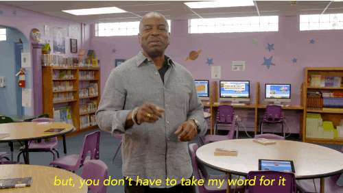

<br>

# **JavaScript 1**
#### CS571: Building User Interfaces


<br>

#### Cole Nelson

---


### JavaScript

This is not a comprehensive introduction to JS, so these are great additional resources:

<div>

 - [MDN Web Docs](https://developer.mozilla.org/en-US/docs/Web/JavaScript)
 - [W3 Schools](https://www.w3schools.com/js/)

</div>

###

Periodically, we will also use [StackBlitz](https://stackblitz.com/) or [CodePen](https://codepen.io/) for code snippets.


---


### Learning Objectives

1. Obtain a broad understanding of web programming.
2. Understand the essentials of JavaScript.
3. Be able to use JavaScript in web programming.
4. Know of other popular tools.


---


### History

 - Developed by Netscape Communications (Brendan Eich) in 1995. 
   - It was designed in 10 days.
 - A "glue language" for HTML.
 - Mocha > LiveScript > JavaScript.
 - Specifications are ECMAScript (e.g. "ES").


---


### A Classic Frontend

A cake with 3 attributes.

| Aspect | Behavior | Cake |
| - | - | - |
| HTML | Structure | Sponge |
| CSS | Design | Icing |
| JS | Behavior | Clown |


---

# Badger Bakery: HTML + CSS

---

# JavaScript Essentials

---


### Try It!

Browser > F12 > Console




---


### Variables

JS is a dynamic, loosely-typed language. The data type is inferred from the declaration and can be changed.

Variables are *containers* that hold data.

There are 7 standard data types: numbers, string, boolean, null, undefined, symbol, object. The first 6 are considered *primitive* and are stored on the *stack*. Object is considered *complex* and stored on the *heap*.


---


### Variable Declarations

Variables can be declared with `var`, `let`, or `const`.

| Keyword | Scope | Re-assignable? | Preferred? |
| - | - | - | - |
| var | function | yes | no |
| let | block | yes | yes |
| const | block | no | yes |

`let` and `const` were introduced in ES6. They are the preferred ways of declaring a variable.


---


### Variable Examples

Consider the following block of code...

```javascript
let age = 27;
const name = "Ashley";
var hasCar = false;
```

Can we perform `age = 28`? Yes! We use `let`.

Can we perform `name = "Carl"`? No! We use `const`.

Is `hasCar` declared correctly? Yes, but we should use `let` instead of `var`.


---


### Variable Examples

Is this block of code correct?

```javascript
let name = "Ahmed";
console.log("My name is " + name);
name = 27;
console.log("My age is " + name);
name += 1;
console.log("My age a year later is " + name);
```

It's not *good* code, but it is *correct* code! Variables can change types during runtime.


---


### Determining Data Types 

We can query the data type at runtime using `typeof`.

```javascript
let foo = "Charles";
console.log(typeof foo);
foo = 1932;
console.log(typeof foo);
foo = true;
console.log(typeof foo);
```

```
string
number
boolean
```


---


### Conditionals
Conditionals allow the code to make decisions and carry out different actions.

###

**Three types:**
1. `if`, `else if`, and `else` statements
2. `switch` statements
3. ternary operators `evalExpr ? trueExpr : falseExpr`


---


### Conditionals
Any value that is not `false`, `undefined`, `null`, `0`, `NaN`, or `""` returns `true`. Why is this useful?

```javascript
var currentMember = "Alice";
let textContent = "?";
if (currentMember) {
  textContent = "View Profile";
} else {
  textContent = "Sign Up";
}
console.log(textContent)
```

```
'View Profile'
```

---


### Comparison and Logical Operators

| Operator | Meaning |
| - | - |
| === and !== | strong comparison |
| == and != | weak comparison |
| < and > | less/greater than |
| <= and => | less/greater than or equal to |
| && | and |
| \|\| | or |


---


### Objects

Objects are unordered collections of data defined using key-value pairs.

```javascript
let teachingAssistant = {
   firstName: "Alice",
   lastName: "Smith",
   age: 24
};
console.log(teachingAssistant);
```

```
{firstName: 'Alice', lastName: 'Smith', age: 24}
```


---


### Object Properties
There are two different notations to access object properties.

```javascript
console.log(teachingAssistant.lastName);
console.log(teachingAssistant["firstName"]);
```
```
'Smith'
'Alice'
```


---


### Arrays
An array is a variable that contains multiple elements.

```javascript
let fruits = ["apple", "banana", "coconut"];
fruits[0] = "apricot";
console.log(fruits);
fruits.push(17);
console.log(fruits);
```

```
['apricot', 'banana', 'coconut']
['apricot', 'banana', 'coconut', 17]
```

**Notice!** They don't have to be the same type.


---


### Looping

For Loops
```javascript
for (let i = 0; i < 10; i++) {}  // typical for loop
for (let attr in course) {}      // loop through object properties
for (let item of arr) {}         // loop through array contents
```

While Loops
```javascript
while(cond) {}                   // typical while loop
do {} while(cond);               // guarantees atleast one execution
```

You can use `break` (exit) and `continue` (skip).


---


### Functions

A procedure that includes a set of statements that performs a task or calculates a value.

```javascript
function fToC(temp) {
  return (temp - 32) * 5/9;
}
fToC(77)
```
```
25
```


---


### Other Ways to Declare Functions

Function Expression

```javascript
const fToC = function(temp) {
  return (temp - 32) * 5/9;
}
```

Arrow Function

```javascript
const fToC = (temp) => {
  return (temp - 32) * 5/9;
}
```


---

# JavaScript and the Web

---


<div>

### Including JavaScript in Your Webpage
- Inline JS
- Internal JS
- External JS

</div>

###

<sub><sup>[XKCD 927: Standards](https://xkcd.com/927/)</sup></sub>


---


### External JavaScript
The JavaScript is included from outside of the HTML.

<sub><sup>index.html</sup></sub>
```html
<html>
  <h1>Welcome to my webpage!</h1>
  <script src='app.js'></script>
</html>
```

<sub><sup>app.js</sup></sub>
```javascript
console.log("hello world!");
```


---


### Internal JavaScript
The JavaScript is included inside of the HTML.

<sub><sup>index.html</sup></sub>
```html
<html>
  <h1>Welcome to my webpage!</h1>
  <script>
    console.log("hello world!");
  </script>
</html>
```


---


### Inline JavaScript
The JavaScript is included inside of the HTML element.

<sub><sup>index.html</sup></sub>
```html
<html>
  <h1>Welcome to my webpage!</h1>
  <button onclick="console.log('hello world!')">Click Me!</button>
</html>
```


---


### Document Object Model (DOM)
HTML is just a tree, where each tag (e.g. object on the page) is a node!

We use JavaScript to manipulate this tree.

<sub><sup>[Document Object Model](https://en.wikipedia.org/wiki/Document_Object_Model#/media/File:DOM-model.svg)</sup></sub>


---


### Manipulating the DOM

Use `document` to reference the DOM.

```javascript
let title = document.getElementbyId("articleTitle");
let loginBtn = document.getElementsByName("login")[0];
let callouts = document.getElementsByClass("callout"); // *
```

<sub><sup>*class refers to a **CSS** class</sup></sub>


We can add *event listeners* or read/modify *properties*.


---


### Manipulating the DOM
Using the DOM elements from the previous slide, we..

<div>

 - Change the title of the article.
 - Add an action for when the button is clicked.
 - Make all of the callouts red.

 </div>

```javascript
title.textContent = 'My Website!';
loginBtn.addEventListener("click", () => {
  console.log("You are advancing to the next part of the site...");
}
for (let callout in callouts) {
  callout.style.color = "red";
}
```


---

# Badger Bakery - JS

---

# Other Tools

---

### What is this "TypeScript" I hear about?

TypeScript (TS) is a strict syntactical superset of JS developed to enable the development of large-scale applications and to add static typing.

A preprocessor is used to transpile TS to JS.

#### Safety of Java + Flexibility of JS = TS

We do not cover TS in this course.

---

### What is this "jQuery" I hear about?

A fast, small, and feature-rich JavaScript library.

Contains all of the functions that you wish were in the standard JavaScript library.
 - **jQuery**: `$("#login")`
 - **DOM**: `document.getElementById('login')`

<sub><sup>[Keep your jQuery up-to-date!](https://security.snyk.io/package/npm/jquery)</sup></sub>


We do not cover jQuery in this course.

---

### What is this "Bootstrap" I hear about?

A CSS Framework for developing responsive and mobile-first websites.

We *will* cover this *next* time :)

---

# On to Design Thinking! 🚀