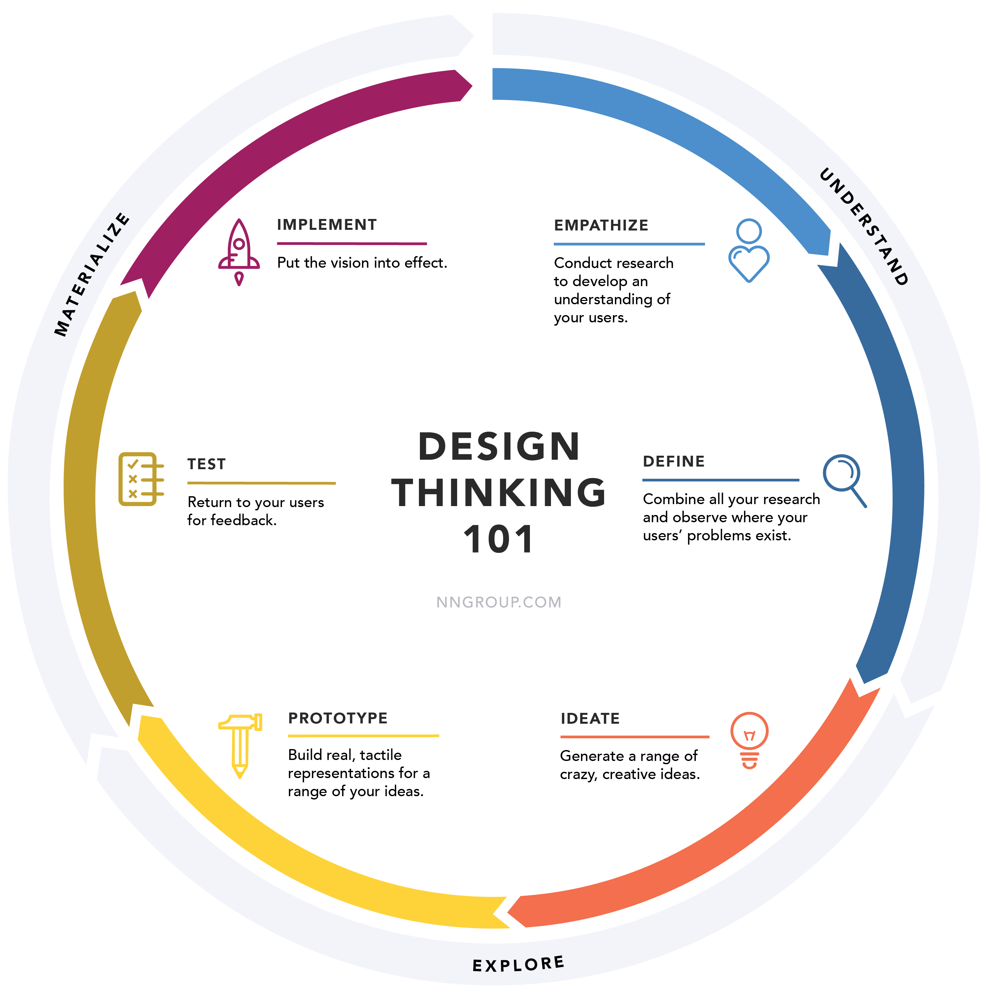

 

# **Prototyping**
### CS571: Building User Interfaces

 

#### Cole Nelson

---

# What we will learn today?

- Prototyping methods
- Prototyping theory
- Choosing the right method
- Using Figma to prototype

---

---
### Prototyping

**Definition:** Building a draft or an early version of a product in order to explore, demonstrate, and test design ideas.

[Image Source](https://www.linkedin.com/learning/ux-design-6-paper-prototyping/)

---

### Prototyping Methods

* Paper prototyping
* Wireframes
* Annotations
* Interactive prototyping
* Native prototyping

---

#### Paper Prototyping

**Definition:** Mocking up design ideas by using *physical* design supplies to simulate how the envisioned system would respond to user input.

[Image Source](https://rocketbuild.com/wp-content/uploads/2018/10/80ccd143064215.57e20b3f41ff5.jpg)

---

Most useful at the earliest stages of design.

         

[Image Source](https://ergomania.eu/paper-prototype-fidelity/)

---

### Wireframes

**Definition:** Lo-fidelity^ prototypes of the makeup of a design in terms of its structural components.

Wireframes can be hand-drawn or digitally created.

Most useful in the early-to-mid stages of the design process.

^ We'll re-visit *fidelity* at the end of the lecture.

---

         
[Image Source](https://dribbble.com/shots/3965309-Travelblog-Wireframe-landing-page-design)

---

### Annotations

**Definition:** Labels, explanations, and notes that provide further information on the goals, content, and functioning of the design elements illustrated on wireframes.

Key in addressing the problem of interpretability of simplified designs for all stakeholders.

---

          

[Image Source](https://www.toptal.com/designers/ux/straight-to-high-fidelity)

---

### Interactive Prototyping

**Definition:** Creating realistic prototypes of the navigation or structural components (or both) of the design idea by creating a series of screens/pages with design elements, linking these screens/pages for navigation, and simulating the transitions between screens/pages.

---

          

[Image Source](https://dgc2qnsehk7ta.cloudfront.net/uploads/adobexd-interface-preview.jpg)

---

Interactive prototypes can be *lo-fidelity* or *hi-fidelity*.

---

          

[Images Source](https://www.behance.net/gallery/18180215/Mobile-Food-Ordering-App-concept)

---

### Native Prototyping

**Definition:** Implementing and testing design ideas on the target technology platform of the design.

---

# Prototyping Theory

---

###  Prototyping Models & Strategies

- Three-dimensional model of prototyping
- Prototyping scope
- Prototyping strategies
- Prototyping fidelity

---

### 3-D Model of Prototyping

Prototypes represent three dimensions of a design idea:

1. Role
2. Look and feel
3. Implementation

[Houde & Hill, 1999](http://blogs.ischool.berkeley.edu/ict4se/files/2010/09/Prototypes_prototype.pdf)

---
### The Dimensions

**Role:** Represents the functions that the system serves in the user's life, i.e., how the system is useful to them.

**Look and Feel:** Simulates the sensory experience of the user while using the system, i.e., what the user sees, hears, and feels during use.

**Implementation:** Includes the technical capabilities that enable the system to perform its function, i.e., the low-level details of how the system works.

---

### **Integration:** The Dimensions Combined

Each dimension can be represented at various levels of fidelity. Their integration makes a working prototype or a pre-alpha product.

This integration represents the complete user experience with the system as envisioned in the conceptual design. 

---

## Prototyping Scope

A prototype is also a space of *features* and *functions*.

---

## Prototyping Scope

**Horizontal Prototype:** Provides a broad view of the entire system and focus on the user interaction rather than the functionality.

**Vertical Prototype:** Focuses on a single feature and provides the full functionality for that feature.

---

---

## Prototyping Strategies

- Throwaway prototyping
- Evolutionary prototyping
- Incremental prototyping
- Extreme prototyping

---

### Throwaway Prototyping

**Definition:** Rapid prototyping to explore design ideas, demonstrate feasibility, communicate with stakeholders, and test the ideas with users and eventually discarding the prototype instead of further developing the model into a final product.

Most lo-fi and paper prototypes are throwaway protototypes. Throwaway prototyping is usually combined with *sketching*.

---

### Throwaway Prototyping

###

        

[Image Source](https://softwareengineering.stackexchange.com/questions/253574/why-we-need-throw-away-prototyping)

---

### Evolutionary Prototyping

**Definition:** Also called *breadboard prototyping*, the design team incrementally builds prototypes of a design idea, tests the idea with users, and refines the prototype until it reaches the desired level of maturity.

Most products we use are evolutionary prototypes that went through alpha, beta, etc. phases.

---

### Evolutionary Prototyping

###

        

[Image Source](https://softwareengineering.stackexchange.com/questions/253574/why-we-need-throw-away-prototyping)

---

### Incremental Prototyping

**Definition:** Dividing system functionality into slices (vertical prototypes) based on design specifications and incrementally building each slice that is then integrated into the overall system.

Appropriate for large and complex projects.

---

### Incremental Prototyping

###

        

[Image Source](https://softwareengineering.stackexchange.com/questions/253574/why-we-need-throw-away-prototyping)

---

### Extreme Prototyping

**Definition:** Breaking down the development into three phases that build on each other: (1) building a static prototype, (2) building fully functional, interactive components that will simulate services, and (3) finally implementing the services.

Enables rapid and parallel prototyping, testing, and refinement by removing dependencies between different components of a system or between the system and third party services.

---

### Extreme Prototyping

###

        

[Image Source](https://softwareengineering.stackexchange.com/questions/253574/why-we-need-throw-away-prototyping)

---

### Fidelity in Prototyping

**Definition:** The level of detail in which a design is represented in the prototype, typically "low" or "high".

[Image Source](https://users.infragistics.com/GeorgeA/Blog/UX-Guidance/hi-lo%20prototypes.png)

---

         

[Image Source](https://miro.medium.com/max/3840/1*Wjsdj0T9gXEe21Ym6O3-2g.png)

---

### Why Fidelity?

The more "done" the prototype looks, the narrower the feedback will be; and vice versa.

> This is just an idea. I'm not done!

Use no higher fidelity than is necessary.

---

### Why bother with lo-fi prototyping?

- Has lower development cost
- Prevents designers from prematurely wedding to specific design ideas
- Enables exploring, communicating, and testing of conceptual designs 
- Helps designers identify structural, navigation, and organizational issues

---

### Why bother with lo-fi prototyping?

- Allows rapid evaluation of multiple design ideas
- Enables communication among stakeholders
- Allows identifying market requirements before dedicating resources to development 

---

### Limitations of Lo-fi Prototyping

- Often requires a facilitator to drive the prototype during testing and communication
- Harder to identify breakdowns in design 
- Lacks sufficiently low-level specifications for development
- Provides limited sense of feasibility

---

         

[Image Source](https://ih1.redbubble.net/image.1690997702.2357/st,small,507x507-pad,600x600,f8f8f8.jpg)

---

### How do we choose the right method?

- Various methods, approaches, and strategies for prototyping 
- Criteria for choosing the right method:
  - Design team goals
  - Capabilities and resources
  - Available time for prototyping 

---

          

Image Source: Unknown

---

## Prototyping with Figma
[figma.com](https://www.figma.com/)

---

### What did we learn today?

- Prototyping methods
- Prototyping theory
- Choosing the right method
- Using Figma to prototype

---

# Next Week
Begin learning *React*.
Learn about *visual design*.

---

# Questions?

