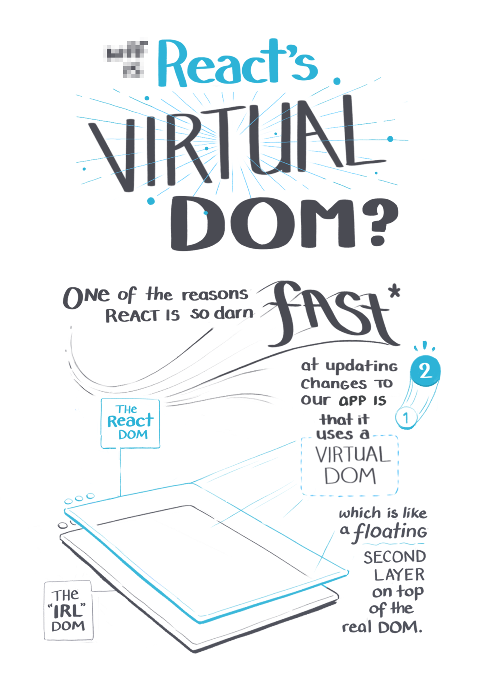
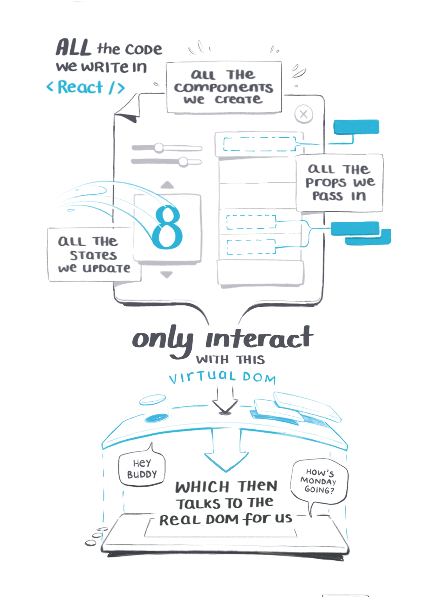
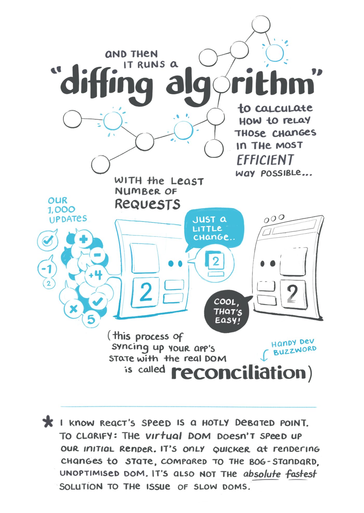
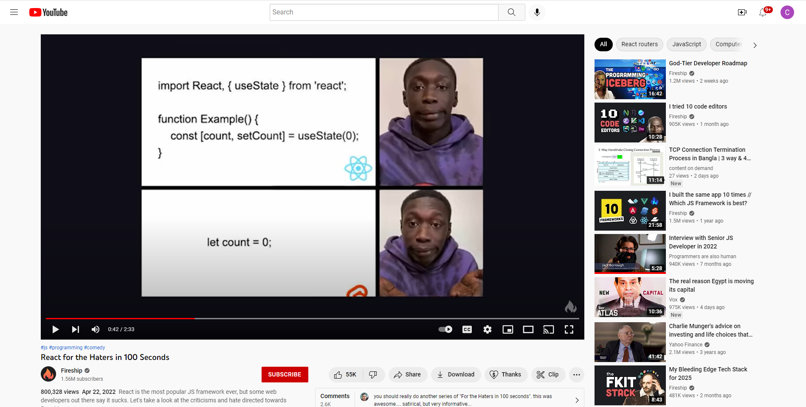

<br>

# **React 1**
### CS571: Building User Interfaces


<br>

#### Cole Nelson

---

### Disclaimer
As with JS, this is not a comprehensive introduction to React, so below are links to great additional resources:

- [ReactJS.org](https://reactjs.org/docs/getting-started.html)
- [W3 Schools](https://www.w3schools.com/react/)
- [Build with React](http://buildwithreact.com/)
- [Tania Rascia's React Overview and Walkthrough](https://www.taniarascia.com/getting-started-with-react/)

---

### Another Disclaimer

If this is your first `CS-5**` class, be prepared to:

- Work on more open-ended problems.
- Know that there is likely more than one "correct" solution.
- Find alternative ways of implementing ideas.

These are great skills to build!

---

### What will we learn today?

<div>

- History and overview of React
- Overview of website building blocks
- Setting up a React project
- Building a basic React project
- Using other components

</div>

---

# Why should we use React?


---

### What is React?

**Definition:** Also called ReactJS, React is a JS library for building user interfaces.

* Developed by Facebook, dating back to 2010.
* Started as an internal development tool, then open-sourced in 2013.

[More on the history of React](https://blog.risingstack.com/the-history-of-react-js-on-a-timeline/)

---

### Refresher

**Definition:** Document Object Model (DOM) translates an HTML document into a tree structure where each node represents an object on the page.

<sub><sup>[Wikipedia: DOM](https://en.wikipedia.org/wiki/Document_Object_Model)</sup></sub>


---

### Refresher: DOM Programming Interface
- **Objects:** HTML elements, such as a paragraph of text.
- **Property:** Value that we can get or set, such as the `id` of an element.
- **Method:** An action we can take, such as adding or deleting an HTML element.

For JS to interact with user-facing elements, we use to access access them `document`, e.g. `document.getElementById`.

---

### Repeat After Me...

```javascript
for (let i = 0; i < 10; i++) {
  console.log('I will no longer use document to access DOM elements.');
  console.log('I will no longer use document to manipulate DOM elements.');
  console.log('I will let React handle the DOM for me.');
}
```

---

## What's so bad about the DOM?
It's slow!

  - *Single-page applications (SPAs)* can be huge.
  - Interactive applications require a large number of and frequent updates on DOM elements.


<sub><sup>[Image Source](https://tenor.com/search/instagram-gifs)</sup></sub>

---

### Solution: The *Virtual DOM*

**Definition:** The virtual DOM is a *virtual* representation of the user-facing elements that are kept in memory and synced with the real DOM when DOM elements are updated.


<sub><sup>[Image Source](https://blog.csdn.net/gongch0604/article/details/86630260)</sup></sub>

---

### Virtual DOM: *Reconciliation*

**Definition:** *Reconciliation* is the process of *diffing* and syncing the virtual and real DOM to render changes for the user.


<sub><sup>[Image Source](https://almerosteyn.com/2017/11/id24-accessible-react-tips-tools-tricks#/22)</sup></sub>

---


<br><br><br><br><br><br><br><br><br><br>

<sub><sup>[Image Source](https://i0.wp.com/programmingwithmosh.com/wp-content/uploads/2018/11/lnrn_0201.png?ssl=1)</sup></sub>

---

### What are the benefits of a Virtual DOM?
- Incredibly fast, as only what is updated in the Virtual DOM is updated in the real DOM.
- Abstracts away interactions with DOM; makes programming more *declarative*.
- Used in React and vue.js; Angular does its own thing.

---

# The ReactDOM

Credit: [Maggie Appleton](https://maggieappleton.com/)


---






---




---

# React
by Meta

###

### 👍❤️😆😮😢😠


---

<div class="center-info">


[React in 100 Seconds](https://www.youtube.com/watch?v=Tn6-PIqc4UM)

</div>

---

### Getting Started

What you will need: *terminal*, *IDE*, *NPM*, and *Node.js*

```bash
npm install -g create-react-app
```

```bash
create-react-app <your-app-name>
cd <your-app-name>
npm start
```

For the HWs, these steps will already be done for you.

---

### React Essentials

Every "thing" is a component.

Every component is a function, inheriting `props` and maintaining an internal `state`.

---

### What defines a component?

<div>

 - Similar question: *what defines a class in Java?*
 - Some re-usable piece of the interface.
 - May have many children, but only one parent.

 </div>

###

#### Identify components in the next slides..

---


---



---

### Example of a React Component

This React component displays Hello World on the webpage using JSX.

```javascript
function Welcome() {
  return <h1>Hello World!</h1>;
}
```

[Babel](https://babeljs.io/) transpiles JSX into JS and HTML counterparts.

[StackBlitz](https://stackblitz.com/edit/react-vokc3e)

---

### Note: Class vs Functional Components

A class component looks like this...

```javascript
class Welcome extends React.Component {
  render() {
    return <h1>Hello World!</h1>;
  }
}
```

Functional components were introduced in React 16.8. They are the most commonly used in new React code. We will not cover class components in this course.

---

### React Components

React components can have props given by its parent...

```javascript
function App() {
  return (
    <div>
      <Welcome person="Charlie"></Welcome>
      <Welcome person="Jessica"></Welcome>
      <Welcome person="Tonya"></Welcome>
    </div>
  );
}
function Welcome(props) {
  return <h1>Welcome, {props.person}</h1>;
}
```

[StackBlitz](https://stackblitz.com/edit/react-6i82yg)

---

### React Components
...or can maintain an internal state.

```javascript
function Welcome() {
  const [name, setName] = useState("Alba");
  return <h1>Welcome, {name}</h1>;
}
```

[StackBlitz](https://stackblitz.com/edit/react-b2yntn)

---

### React Components
... or have both!

```javascript
function App() {
  return <Welcome message="Good evening, "></Welcome>
}

function Welcome(props) {
  const [name, setName] = useState("Rodriguez");
  return <h1>{props.message} {name}</h1>;
}
```

[StackBlitz](https://stackblitz.com/edit/react-bunygm)

---

### React Hooks
Hooks are small React features. Today, we will cover...

<div>

 - `useState`
 - `useEffect`

 </div>

Next week we will cover...

<div>

- `useContext`
- `useRef`
- `useReducer`
- `useMemo`
- `useCallback`

</div>

---

### `useState` Hook

Used to maintain state! Takes an initial value as an argument. Returns a pair of the *read-only* state value and a mutator function.

*Always* use the mutator function to modify state.

*Never* modify the state directly.

```javascript
const [name, setName] = useState("James");
```

---

### `useEffect` Hook
Used to perform an action on page load or change. Takes a callback function and, optionally, an array of state dependenices as arguments.

```javascript
useEffect(() => {
  alert("The page has been reloaded!");
})
```

```javascript
useEffect(() => {
  alert("You changed your name to " + name);
}, [name])
```

<sub><sup>We do not cover [function cleanup](https://reactjs.org/docs/hooks-effect.html#example-using-hooks-1).</sup></sub>

---

# Let's make a React App!
Find my Badgers using [randomuser.me](https://randomuser.me/)

---

### A Reminder of Library Usage

During the "JavaScript", "React", or "React Native" weekly assignments, students must incorporate at least one additional, meaningful third-party library into at least one of their submissions and provide a short description about its use. Such third-party libraries could be jquery, typescript, axios, redux, mobx, beautiful-dnd, and lodash; other meaningful third-party libraries are also acceptable.


---

### What did we learn today?

<div>

- History and overview of React
- Overview of website building blocks
- Setting up a React project
- Building a basic React project
- Using other components

</div>

---

# On to Visual Design! 🚀