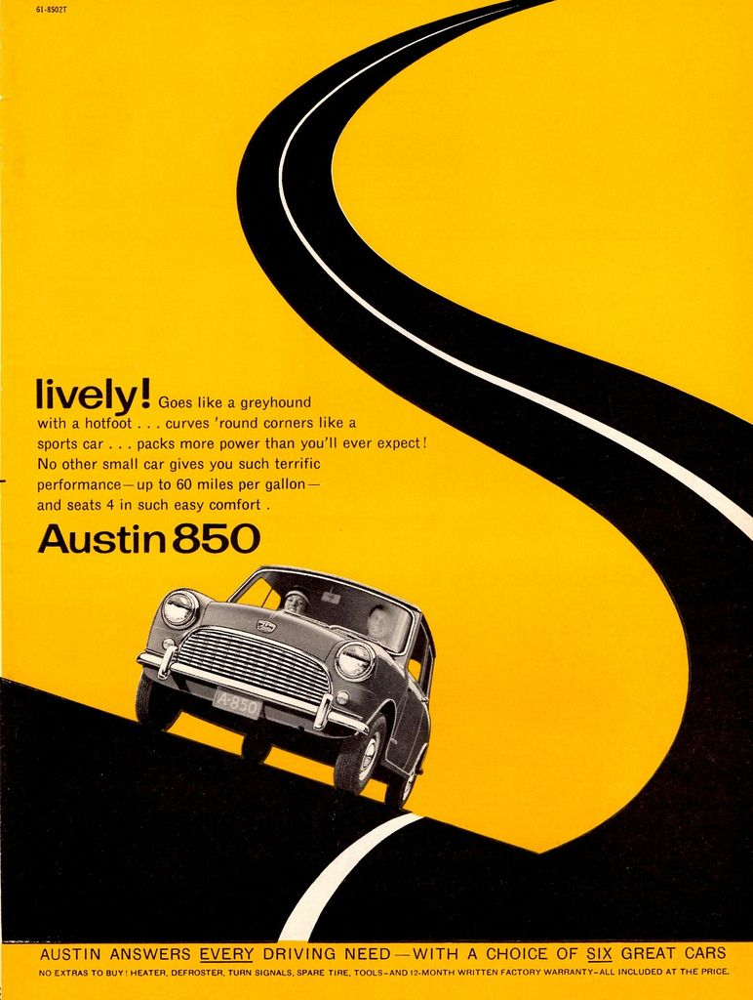

 

# **Visual Design**
### CS571: Building User Interfaces

 

#### Cole Nelson

---

# What we will learn today?

* Elements and principles of design
* Color, type, and images

---

# Elements of Design

---

# Elements of Design
1. Space
2. Line
3. Shape
4. Size
5. Pattern
6. Texture
7. Value

---

# Space[^1]

[^1]: Image sources: [this slide](https://imgur.com/r/pixar/LEIVd), next slide: [left](https://www.adsoftheworld.com/media/print/ibm_outcomes_oil), [right](https://www.adsoftheworld.com/media/print/ibm_outcomes_food)

**Definition:** Space is the canvas on which visual elements are placed.

- Space can be *positive* or *negative*
- *Positive:* where the subject is positioned
- *Negative:* the space surrounding the subject
- Negative space can be used as positive

---

[.hide-footer]

---

# Line[^2]

[^2]: [Image source](https://cdn.inspirationhut.net/wp-content/uploads/2017/06/illustrator-brushes.jpg)

**Definition:** The most primal design element that can divide space, call attention to, organize, and make up other elements.

---

# Shape[^3]

[^3]: Image sources: [this & next slides](https://visme.co/blog/geometric-meanings/)

**Definition:** Space outlined by a contour.

- *Organic* vs. *inorganic* shapes

---

[.column]

[.column]

---

# Size[^4]

[^4]: [Image source](https://blog.slideshare.net/2014/07/07/the-elements-of-design-for-presentations)

**Definition:** Size, or *scale*, is the relative extent of the design elements such as shapes and lines.

---

# Pattern[^5]

[^5]: [Image source](https://forallcreators.com/kimono-patterns/)

**Definition:** Pattern, or *repetition*, systematic duplication of other design elements such as shapes and lines.

---

# Texture[^6]

[^6]: [Image source](https://www.onlygfx.com/wrinkled-brown-paper-textures-jpg-vol-2/)

**Definition:** Tactile and visual quality of a shape or space made up of different colors, materials, and different structures.

---

# Value[^7]

[^7]: Image source

**Definition:** The intensity in which a design element is expressed.

---

# Principles of Design

---

# Principles of Design
1. Focal Point
2. Contrast
3. Balance
4. Movement
5. Rhythm
6. Perspective
7. Unity

---

# Focal Point[^8]

[^8]: Images sources: [this slide](https://www.canva.com/learn/visual-design-composition/), next slide: [left](https://www.originalfilmart.com/products/127-hours-2010), [right](https://www.pinterest.com/pin/557813103840494805/)

**Definition:** Focal point, or the area of visual interest, is where the design directs the attention of the viewer first.

---

---

# Contrast[^9]

[^9]: Image sources: [this slide](https://www.pinterest.com/pin/469781804853076393/), next slide: [left](https://www.pinterest.cl/pin/470204017337109683/), [right](https://www.digitalspy.com/tech/a811886/the-ipod-just-turned-15-heres-the-original-ipod-ad/)

**Definition:** Contrast, is the juxtaposition of design elements that strikingly differ from each other to guide user attention and action.

---

[.hide-footer]

---

# Balance[^10]

[^10]: [Image source](https://i.pinimg.com/originals/57/1e/c2/571ec22bf6ed7dea92315c1f5398775a.jpg)

**Definition:** The organization of design elements on a canvas to provide a sense of visual balance or imbalance. 

*Pro Tip:* Balance can be achieved through *symmetry* or *asymmetry*.

---

# Movement[^11]

[^11]: [Image source](https://ctcardinal.wordpress.com/2011/09/22/2d-principles-of-design/)

**Definition:** The organization of design elements in a way that suggests a particular flow on the canvas to direct the user's attention in a particular pattern.

---

# Rhythm[^12]

[^12]: [Image source](https://www.pinterest.com/pin/200128777167369533/)

**Definition:** Patterned use of design elements in a way that communicates movement or order.

---

# Perspective[^13]

[^13]: Image sources: [this slide](https://mymodernmet.com/elements-of-art-visual-culture/), next slide: [left](https://www.pinterest.com/pin/4855512070550641/), [right](https://www.joblo.com/movie-posters/1976/rocky/image-27746)

**Definition:** Creating a sense of horizon and movement along the depth axis of canvas.

---

---

# Unity[^14]

[^14]: Image sources: [this slide](https://www.designyourway.net/blog/graphic-design/graphic-design-principles-definition-and-basics-you-need-for-good-design/), next slide: [left](https://opentextbc.ca/wp-content/uploads/sites/42/2015/08/), [right](https://koleksigambarposter.blogspot.com/2019/04/tren-untuk-poster-designs-creative.html)

**Definition:** Unity reflects the holistic consistency in the use of design elements.

---

---

# This all sounds good. But how do we actually use these?

---

# Some Strategies

- Create *cheat sheets*, and *checklists*
- Analyze existing designs using these tools to build visual analysis skills
- *Practice* designing using the principles
	- *Pro Tip:* Your canvas should have no elements that do not follow an overall principle

---

# **In-class Design Exercise 1**

Analyze an existing page using the design elements and principles

- What elements, principles can you see in use?
- What problems do you see that can be addressed using design principles?

Make a copy of the [Google Drawings template](https://docs.google.com/drawings/d/13kOlu7fBTd4a_VTralQu5KxXvytoKdp36yU6qlgmy8Y/edit), annotate, and submit a PDF within 24 hours as *Quiz 3*.

---

[.hide-footer]

---

# **In-class Design Exercise 2**[^15]

[^15]: Image sources: [this slide](https://blog.tubikstudio.com/ux-wireframing-bedrock-of-interface-usability/), elements/principles: [first](https://gcucommunity.com/2015/05/18/dash-of-inspiration-principles-elements-design/), [second](https://visme.co/blog/elements-principles-good-design/)

Consider the *last* product you purchased online. Design a product page with the following elements:

- Product photo
- Product description, reviews, similar items
- Action buttons: choose color, add to cart, add to wishlist

Make a copy of the [template](https://docs.google.com/drawings/d/1ZqU7zZMa6AkQCd3j4B3Z08lD5qp4FUbAMeTY748tkPY/edit), place elements & annotate with your decisions, and submit a PDF as *Quiz 4*.

---

[.hide-footer]

---

[.hide-footer]

---

[.hide-footer]

---

# Key Components for UX Design

---

# Key Components for UX Design

We will focus on *type*, *color*, and *images*.

---

# Type

**Definition:** Printed letters and characters of language.

---

# Associated Concepts

- A **font** is the style in which type is created.
- A **typeface** is a font family that includes fonts of different variations that follow the same style.
- A **glyph** is a particular character.

---

# Categories of Typefaces

1. Old style
2. Modern
3. Slab serif
4. Sans serif
5. Script
6. Decorative

---

# Old-style fonts

**Definition:** Old-style fonts have "serifs" at the tips of a glyph that taper closer to the tip.

---

# Modern & slab-serif fonts

**Definition:** Modern and slab-serif fonts have very thin or very thick serifs.

---

# Sans-serif fonts

**Definition:** Sans-serif fonts lack the serif at the tips of the glyphs, and their strokes follow uniform weight.

---

# Script fonts

**Definition:** Script fonts simulate cursive writing where glyphs connect with each other at the downstroke. 

---

# Decorative fonts

**Definition:** Decorative fonts are designed specifically to convey a particular context or elicit a particular feeling, e.g., "gothic."

---

# Font parameters

* **Style variations:** bold, italic, oblique
* **Caps:** all caps, small caps
* **Weight:** extra light, light, medium, bold

---

*Pro Tip:* Type alone can be used to achieve design principles, such as *hierarchy* and *movement*.

^ https://learn.g2.com/visual-hierarchy

^ https://www.pinterest.com/pin/474426141977925953/

---

*Pro tip:* For good typography, become familiar with *leading*, *tracking*, *kerning*, *widows*, *orphans*, *rags*, *rivers*.

^ https://www.herronprinting.com/resources/the-ideas-collection/all-alone-and-misunderstood-widows-orphans-runts-and-rivers/

---

# Color

**Definition:** Human visual perception of light reflecting from an object.

- Creates emphasis
- Organizes content
- Evokes emotion

---

[.hide-footer]

---

[.hide-footer]

---

# The Color Wheel

- *Primary*, *secondary*, *tertiary* colors
- *Tints*, *shades*,*tone*
- *Complementary* colors
- *Warm*, *cool* colors

^ https://blog.tubikstudio.com/color-theory-brief-guide-for-designers/

---

---

---

# Color Palettes

1. Analogous
2. Complementary
3. Split Complementary
4. Triadic
5. Monochromatic
6. Achromatic

^ https://sarahrenaeclark.com/understanding-color-theory-basics/color-theory-infographic-color-harmonies-2/

---

---

---

---

# Color Vision Deficiencies

- Affects 8% of males, 0.5% of females 
- Consider alternatives
		- *Intensity* vs. *hue* for emphasis
		- *Size* of colored elements
		- *Proximity* of similar colors
- Use [*tools*](https://www.ghacks.net/2017/03/02/run-color-blindness-tests-on-your-websites/) to check designs

^ [Dundas](https://www.dundas.com/resources/dundas-data-visualization-blog/visualizing-for-the-color-blind)

---

# Images

**Definition:** Photographs, illustrations, three-dimensional art, silhouettes, icons, dingbats, infographics, and simpler shapes that convey rich information or context.

---

---

---

# 4 Quiz Questions

Complete the quizzes within 24 hours

