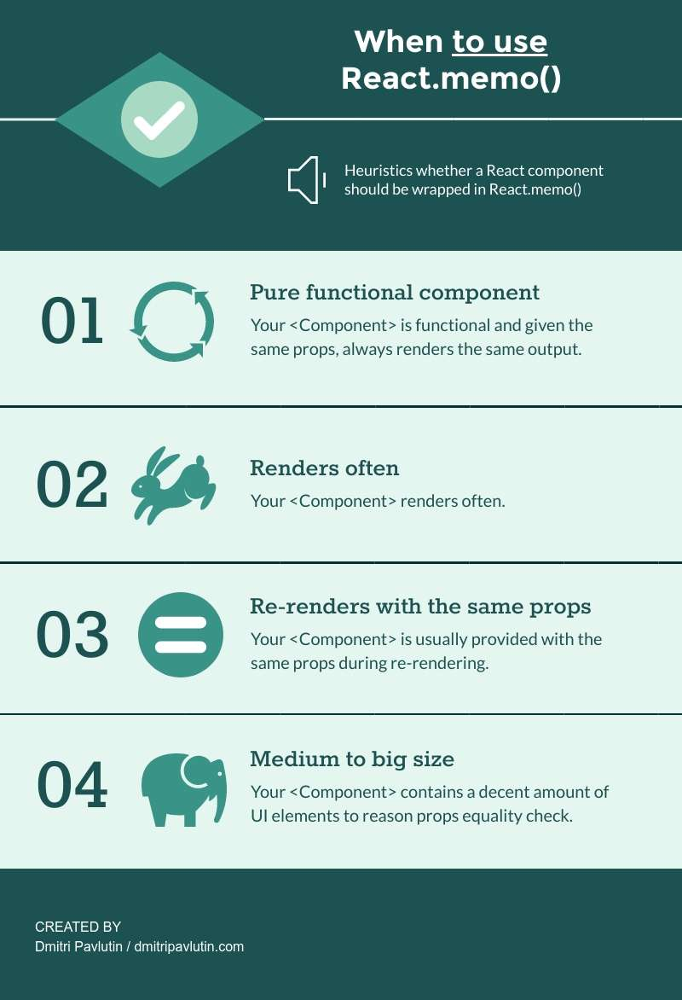

<br>

# **React 2**
### CS571: Building User Interfaces


<br>

#### Cole Nelson

---

### What will we learn today?

<div>

- A Review of React
- Using Routing in React
- More React Hooks (`useContext`, `useCallback`, and `useMemo`)
- React Memoization


</div>

---

# React Review

---

### React Essentials

Every "thing" is a component (usually written in JSX).

Every component is a function, inheriting `props` and maintaining an internal `state`.

```javascript
function Welcome() {
  return <h1>Hello World!</h1>;
}
```

---


---

### `useState` Hook

Used to maintain state! Takes an initial value as an argument. Returns a pair of the *read-only* state value and a mutator function.

*Always* use the mutator function to modify state.

*Never* modify the state directly.

```javascript
const [name, setName] = useState("James");
```

---

### `useEffect` Hook
Used to perform an action on page load or on state change. Takes a callback function and, optionally, an array of state dependenices as arguments.

```javascript
useEffect(() => {
  alert("The page has been reloaded!");
})
```

```javascript
useEffect(() => {
  alert("You changed your name to " + name);
}, [name])
```
---

### Digression: Ref, Shallow, & Deep Copy

In JavaScript 2, we had learned about a *reference* and a *deep* copy. There also exists a *shallow* copy.

```javascript
let myBasket = {
  basketId: 154,
  items: ["Apples", "Bananas", "Grapes"]
};

let refCopyBasket = myBasket;
let shallowCopyBasket = {... myBasket};
let deepCopyBasket = JSON.parse(JSON.stringify(myBasket));
```

---

### Implications for Setting State

We must use a *shallow* or *deep copy* for setting state.

```javascript
// BAD **DO NOT USE** - this is just a reference copy!
let badgersCopy = badgers;
badgersCopy.push({
  name: "Jennifer Mnookin",
  roles: ["chancellor"]
});
setBadgers(badgersCopy);
```

We should do...

```javascript
let badgersShallowCopy = [... badgers];
let badgersDeepCopy = JSON.parse(JSON.stringify(badgers));
```


---

# In-Class Example

Use a new React w/ JavaScript StackBlitz on the web, or use `create-react-app` on your own device!

[See StackBlitz Solution](https://stackblitz.com/edit/react-fpzwhu)


---

### React is a *library*, not a *framework*!
This means that *batteries are not included*. You'll be choosing many of your own tools and libraries!
   - **Layout & Design:** [Bootstrap](https://www.npmjs.com/package/bootstrap) [React-Bootstrap](https://react-bootstrap.github.io/), [Reactstrap](https://reactstrap.github.io/), [Material](https://mui.com/), [Elemental](http://elemental-ui.com/), [Semantic](https://semantic-ui.com/)
   - **Routing & Navigation:** [React Router](https://reactrouter.com/en/main), [React Navigation](https://reactnavigation.org/), [React Location](https://react-location.tanstack.com/)
   - **State Management:** [Redux](https://react-redux.js.org/), [Recoil](https://recoiljs.org/), [MobX](https://mobx.js.org/README.html), [XState](https://xstate.js.org/)


---

# Navigation w/ [React Router](https://reactrouter.com/en/main)
See [StackBlitz](https://stackblitz.com/edit/react-hbvgas)

---

### Types of Routers
 - `BrowserRouter`: What you typically think of!
 - `MemoryRouter`: Same as `BrowserRouter`, but the path is hidden from the browser in memory! 🤫
 - `HashRouter`: Ugly, early days `#` implementation.
 - `StaticRouter`: Used for server-side rendering.
 - `NativeRouter`: We'll use [react-navigation](https://reactnavigation.org/) instead!

---

### Routing
Using a `Router`, `Routes`, and `Route`!

```jsx
<BrowserRouter>
  <Routes>
    <Route path="/" element={<Layout />}>
      <Route index element={<Home />} />
      <Route path="about-us" element={<AboutUs />} />
      <Route path="other-info" element={<OtherInfo />} />
      <Route path="*" element={<Home />} />
    </Route>
  </Routes>
</BrowserRouter>
```

---

### Navigable Components

Notice how each route maps to a component.

```jsx
function Home() {
  return <h2>Home</h2>
}
function AboutUs() {
  return <h2>About Us :)</h2>
}
function OtherInfo() {
  return <h2>Other Info!</h2>
}
```


---

### Navigation
Navigation for a `BrowserRouter` is done via URLs.

```jsx
<>
  <Navbar bg="dark" variant="dark">
    <Nav className="me-auto">
      <Nav.Link as={Link} to="/">Home</Nav.Link>
      <Nav.Link as={Link} to="/about-us">About Us</Nav.Link>
      <Nav.Link as={Link} to="/other-info">Other Info</Nav.Link>
    </Nav>
  </Navbar>
  <Outlet />
</>
```

---

# React Hooks

---

### React Hooks
Last week we covered...

<div>

 - `useState`
 - `useEffect`

 </div>

Today we will cover...

<div>

- `useContext`
- `useCallback`
- `useMemo`

</div>

---

### React Hooks
 - `useContext`: A useful hook for managing state across web apps with large component hierarchies.
 - `useCallback`: An optimization hook for preserving callback functions.
 - `useMemo`: An optimization hook for preserving calculated values.

---

### `useContext` Hook

**Motivation:** How can we effectively manage state for web apps with large component hierarchies?

```
SpotifyLandingPage
 - NavBar
   - NavArrows
   - SearchBox
 - RecentSearches
   - AuthorCard
     - AuthorImage
     - AuthorName
```

**Alt. Solution:** State Management Libraries

---

### `useContext` Hook
Three steps to using context.

<div>

1. Create and export a context.
2. Provide the context with some value.
3. Use the context in a child component.

</div>

<br>

Often used in combination with `useState`.

---

### `useContext` Hook

A context must be exported.

```javascript
export const MyDataContext = createContext([]);
```

---

### `useContext` Hook

A context must be provided to child component(s).

```jsx
function ParentComponent() {
  const [data, setData] = useState([]);
  return (
    <MyDataContext.Provider value={[data, setData]}>
        <SomeChildComponent />
        <SomeOtherChildComponent />
    </MyDataContext.Provider>
  );
}
```

---

### `useContext` Hook

The context can be used by any of child, grandchild, great-grandchild, etc. component(s).

```jsx
function SomeChildComponent() {
  const [data, setData] = useContext(MyData);
  return (
    { /* Do something interesting with data here! */ }
  );
}
```

[See StackBlitz](https://stackblitz.com/edit/react-vbtkmq)

---

### `useCallback` Hook

Consider the following functional component...

```javascript
function MyApp() {
  const myComplicatedFunction = () => {
    // ...
  }

  return <>
    <button onClick={myComplicatedFunction}>Click Me</button>
  </>
}
```

How many times do we *create* the function `myComplicatedFunction`? We do on *every render*!

---

### `useCallback` Hook

`useCallback` is used to ['memoize'](https://whatthefuck.is/memoization) a callback function.

```javascript
function MyApp() {
  const myComplicatedFunction = useCallback(() => {
    // ...
  }, []);

  return <>
    <button onClick={myComplicatedFunction}>Click Me</button>
  </>
}
```

Takes a callback function to 'memoize' and an optional list of dependencies (e.g. when to re-'memoize').

---

### `useMemo` Hook

Same thing as `useCallback`, except memoizes the *value* of a *callback* rather than the *callback* itself.

```javascript
function MyApp() {
  const myComplicatedValue = useMemo(() => { /* Some complex call */}, []);

  return <>
    <p>{myComplicatedValue}</p>
  </>
}
```

---

### `memo`-ized Components

Used for creating *purely functional* components. Given the same props, the function renders the same output.

```javascript
//                  v--- Name of functional component!
export default memo(GroceryList, (prevProps, nextProps) => {
  return prevProps.apples === nextProps.apples &&
    prevProps.bananas === nextProps.bananas &&
    prevProps.coconuts === nextProps.coconuts;
})
```

[See StackBlitz](https://stackblitz.com/edit/react-9nbqzn) for `useCallback`, `useMemo`, and `memo`

---


---


---

### Finding a Balance

1. Given the same input, renders the same output.
2. Is rendered often.
3. Does not change often.
4. Is of substantial size.

[Dmitri Pavlutin Blog Post](https://dmitripavlutin.com/use-react-memo-wisely/)



---

# Badger Bingo
Cumulative example, [see StackBlitz](https://stackblitz.com/edit/react-cucumq).

---

### What did we learn today?

<div>

- A Review of React
- Using Routing in React
- More React Hooks (`useContext`, `useCallback`, and `useMemo`)
- React Memoization

</div>

---

# On to Web Design! 🚀
