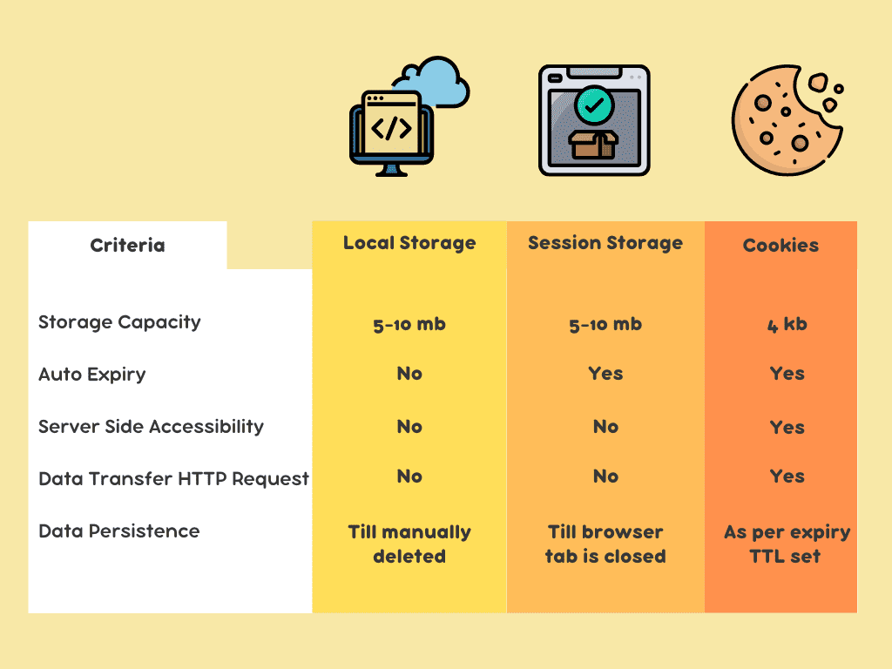
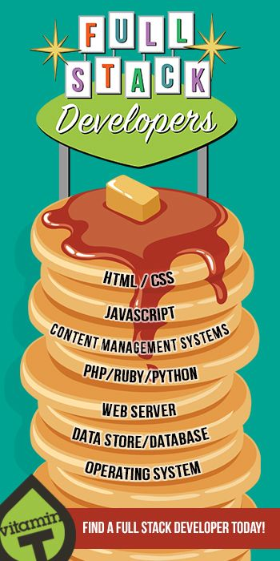
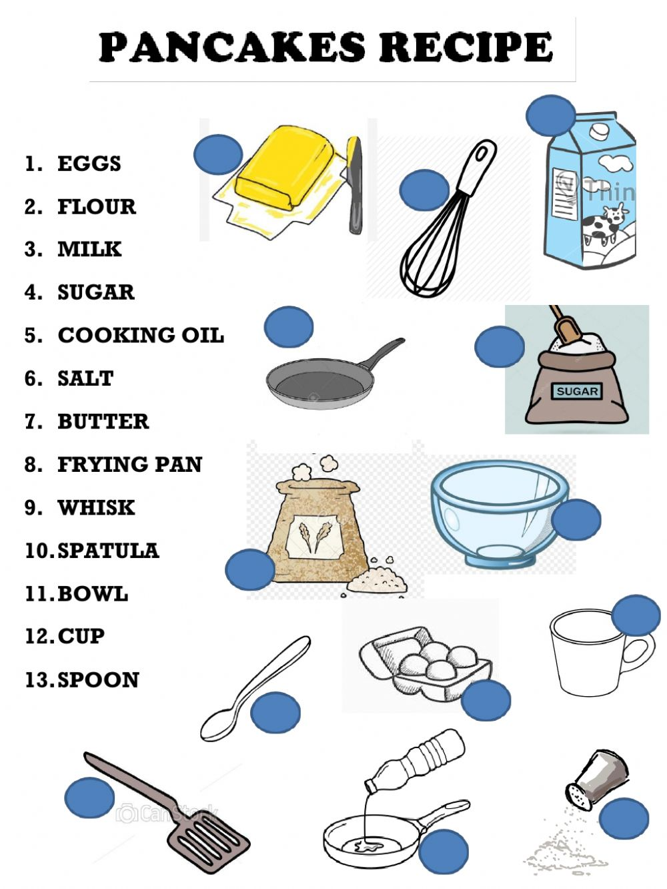
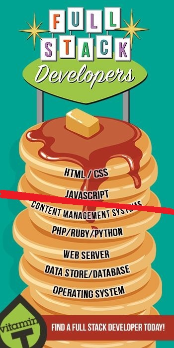
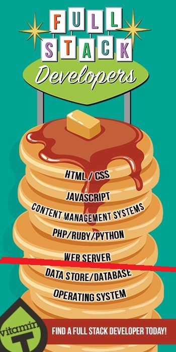
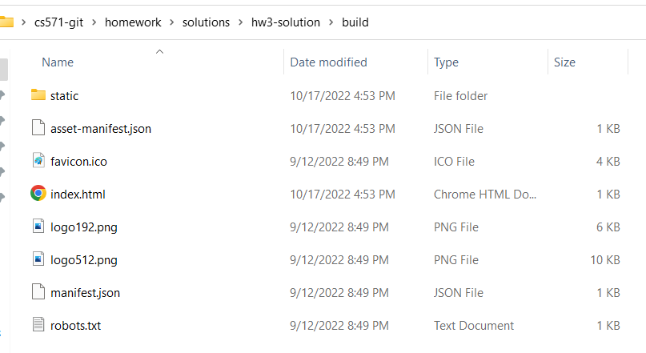
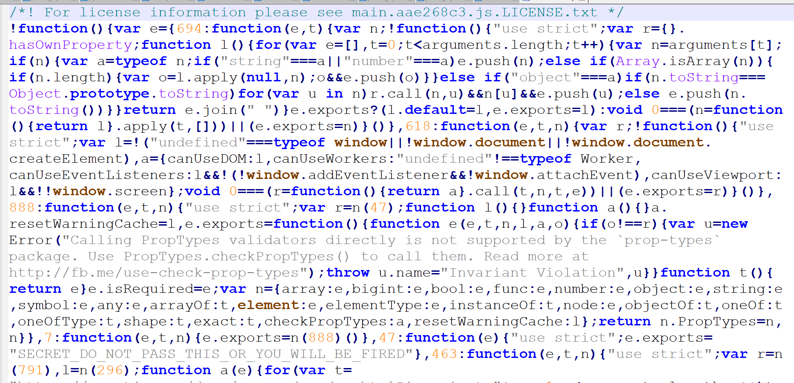

<br>

# **React 4**
### CS571: Building User Interfaces


<br>

#### Cole Nelson

---

### Announcements
 - Today will be broken into 3 parts: React, Expert Evaluation, and Midterm Review.
 - Midterm **next week** in class (details again later).
 - Please contact me **today** if you will not be able to make the exam (Canvas/HonorLock alternative).
 - HW5 was extended to Friday, 10/21 with no penalty (final late day of 10/28).

---

### What will we learn today?

<div>

 - Persistance
 - Custom React Hooks
 - Bigger Picture for React Apps
 - Preparing for React Native...

</div>

---

# How can we *persist* data?

---

```javascript
fetch("https://example.com/create-content", {
    method: "POST",
    headers: {
        "Content-Type": "application/json"
    },
    body: JSON.stringify({
        content: "Hello World!"
    })
}).then(res => {
    if (res.status === 409) {
        alert("This content already exists!")
    }
    return res.json();
}).then(json => {
    if (json.msg) {
        alert(json.msg)
    }
});
```

---


<br><br><br><br><br><br><br><br><br><br>

[Image Source](https://www.loginradius.com/blog/engineering/guest-post/local-storage-vs-session-storage-vs-cookies/)

---



<br><br><br><br><br><br><br><br><br><br>

[Image Source](https://www.loginradius.com/blog/engineering/guest-post/local-storage-vs-session-storage-vs-cookies/)

---

### Cookies vs. Session vs. Local

|  Type | Notes |
| --- | --- |
| Cookies | Can be set programmatically, but typically set by server through a `Set-Cookie` header| 
| Session | Set programmatically via `sessionStorage`, typically used with form data.|
| Local | Set programmatically via `localStorage`, typically used with long-lasting data.|

---

### Cookies vs. Session vs. Local

These are all just key-value pairs of *strings*!

|  Type | Example |
| --- | --- |
| Cookies | `document.cookie = 'lang=en'`| 
| Session | `sessionStorage.setItem('name', 'Cole')`|
| Local | `localStorage.getItem('lastLogin')`|

---

# Let's Persist Some Data!
Using `sessionStorage` or `localStorage`.

<br>

[StackBlitz Solution](https://stackblitz.com/edit/react-1hqggd) | [Inspitation from WDS](https://blog.webdevsimplified.com/2019-11/how-to-write-custom-hooks/)

---

# How Can We Reuse Logic?
Practicing **D**on't **R**epeat **Y**ourself (DRY)

---

### Custom React Hooks

You can write your own custom hooks! These are just JavaScript functions that can use React's features!

 - We use **custom components** to re-use **UI elements**.
 - We use **custom hooks** to re-use **business logic**.

[JSConf Talk](https://www.youtube.com/watch?v=J-g9ZJha8FE)

---

# Let's Write a Custom Hook!
Writing reusable logic for persisting data.

<br>

[StackBlitz Solution](https://stackblitz.com/edit/react-yxigdl) | [Inspitation from WDS](https://blog.webdevsimplified.com/2019-11/how-to-write-custom-hooks/)

---

# Congrats!
You are now a React Devloper! 🥳🎊🎉

---

### Questions You Should Ask Yourself...
- What even is "frontend development"?
- Where does this fit in to the software stack?
- How can I get my web app out in front of customers?
- What concerns should I have about my web app?
- What else can I do with these skills?
- How much of a raise should I ask for? 💰

---

### Software Stack



Think of software like a stack of pancakes...

[Image Source](https://www.pinterest.com/pin/looking-for-a-full-stack-developer-weve-got-you-covered--456693218441395202/)

---

### Software Stack


... where each pancake can be its own flavor...

[Image Source](https://cookingwithmammac.com/flavored-pancakes/)

---

### Software Stack

... and can be cooked its own way...



[Image Source](https://www.liveworksheets.com/worksheets/en/English_as_a_Second_Language_(ESL)/Recipes/Lets_make_pancakes_ty1088539hd)

---

### Software Stack

... with as many or as few as we want!


[Image Source](https://www.goodhousekeeping.com/uk/food/a552834/this-stack-of-pancakes-has-2500-calories/)

---

### Software Stack

We typically refer to the "frontend" as the content that gets delivered to the user...



[Image Source](https://www.pinterest.com/pin/looking-for-a-full-stack-developer-weve-got-you-covered--456693218441395202/)

---

### Software Stack

...but this can change based on your perspective!



[Image Source](https://www.pinterest.com/pin/looking-for-a-full-stack-developer-weve-got-you-covered--456693218441395202/)

---

### The Browser


However, we are constrained to what the browser can interpret...

<div>

 - HTML
 - CSS
 - JS

</div>

---

# So... is React an Exception?
Facebook is influential, but not *that* influential!

---

### Reminder: JSX

This React component displays Hello World on the webpage using JSX.

```javascript
function Welcome() {
  return <h1>Hello World!</h1>;
}
```

[Babel](https://babeljs.io/) transpiles JSX into JS, CSS, and HTML.

---

### Delivery of React App
We don't deliver our JSX code, we deliver HTML, CSS, and JS generated via `npm run build`!

Also, specify a home page (absolute or relative)...

```json
{
  "name": "hw3",
  "version": "0.1.0",
  "private": true,
  "homepage": "https://coletnelson.us/mycoolapp/",
  "dependencies": {
    ...
  }
}
```

---

# What does this do?
Creates our "build bundle"...

---



---

```html
<html lang="en">
  <head>
    <meta charset="utf-8" />
    <link rel="icon" href="./favicon.ico" />
    <meta name="viewport" content="width=device-width,initial-scale=1" />
    <meta name="theme-color" content="#000000" />
    <meta name="description" content="Web site created using create-react-app" />
    <link rel="apple-touch-icon" href="./logo192.png" />
    <link rel="manifest" href="./manifest.json" />
    <title>React App</title>
    <script defer="defer" src="./static/js/main.aae268c3.js"></script>
    <link href="./static/css/main.ace4cd11.css" rel="stylesheet">
  </head>
  <body><noscript>You need to enable JavaScript to run this app.</noscript>
    <div id="root"></div>
  </body>
</html>
```

---



---

### Build Bundle Deployment

<br><br><br><br><br><br><br><br>


---

### Concerns in Production...

<div>

 - Reliability
 - Performance
 - Monitoring
 - Business Value of Delivery
 - Search Engine Optimization (SEO)

</div>

---

### Reliability

Does our code work?

<div>

- Manual testing
- Automated testing
  - [Jest](https://jestjs.io/)
  - [React Testing Library](https://testing-library.com/docs/react-testing-library/intro/)
- Static analysis
  - [TypeScript](https://www.typescriptlang.org/): Used for type-checking
  - [ESLint](https://eslint.org/): Used for following best practice

</div>

---

### Performance

Does our code work *well*?

<div>

 - Be aware of the "bundle size"!
 - Our code specifically...
   - [Perf](https://reactjs.org/docs/perf.html)
   - [Profiler](https://reactjs.org/blog/2018/09/10/introducing-the-react-profiler.html)
 - Our code broadly...
   - [Google Lighthouse](https://developer.chrome.com/docs/lighthouse/overview/)
   - [Chrome User Experience Report (CrUX)](https://developer.chrome.com/docs/crux/)

</div>

---

### Monitoring

Does our code *continue to* work well?

<div>

 - Logging
   - *Not* `console.log`
   - [Sentry](https://sentry.io/welcome/)
   - [DataDog](https://www.datadoghq.com/)
 - Cloud Tools
   - Cloud Monitoring Tools
   - [DownDetector](https://downdetector.com/)

</div>

---

### Business Value of Delivery

<div>

 - Core Questions
   - Are we making money? 💸
   - Are users making use of new features?
 - Analysis Methods
   - [A/B Testing](https://vwo.com/ab-testing/)
   - [Customer Surveys](https://www.helpscout.com/blog/customer-survey/)
 - Commercial Tools
   - [Pendo](https://www.pendo.io/)

<div>

---

### Search Engine Optimization (SEO)
The generated HTML simply says...
```
You need to enable JavaScript to run this app.
```
What is a search engine crawler supposed to do?

**Option:** Server Side Rendering [next.js](https://nextjs.org/)

---

# Up Next: React Native
[React Native in 100 seconds](https://www.youtube.com/watch?v=gvkqT_Uoahw)

---

### What did we learn today?

<div>

 - Persistance
 - Custom React Hooks
 - Bigger Picture for React Apps
 - Preparing for React Native...

</div>

---

### Quick Reminder

During the "JavaScript", "React", or "React Native" weekly assignments, students must incorporate at least one additional, meaningful third-party library into at least one of their submissions and provide a short description about its use.

**Please submit the seperate Canvas assignment.**

You may go *back* and use a library, just let me know!

---

### Quick Reminder

Please complete the [AEFIS Mid-Semester Survey](https://aefis.wisc.edu/) by Saturday, October 22nd! 🙂

This is optional and not required but encouraged!

Please submit the Canvas assignment acknowledging that you *can* (but don't have to) complete it.

I will leave the room so you have time.


---

# On to Expert Evaluation! 🚀
