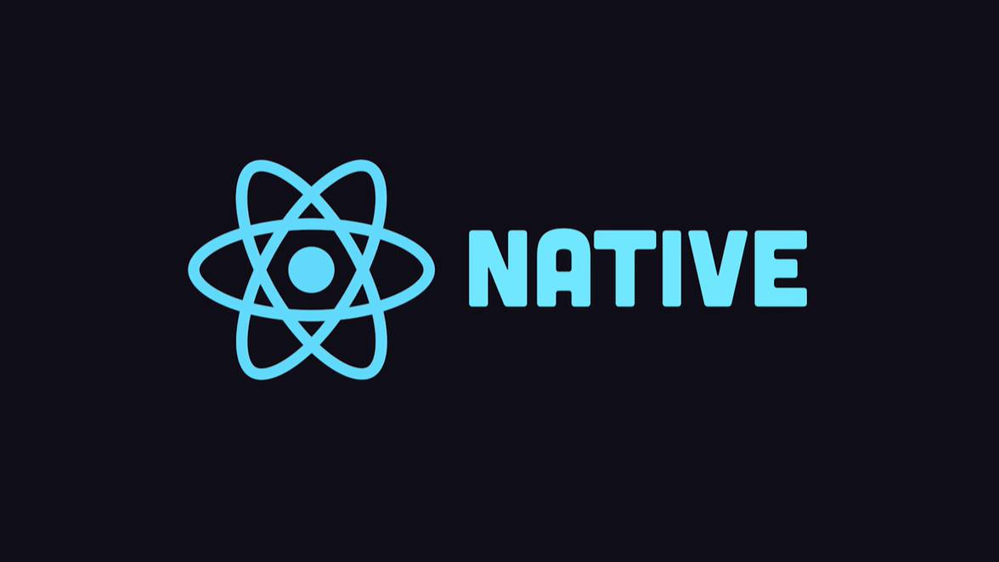
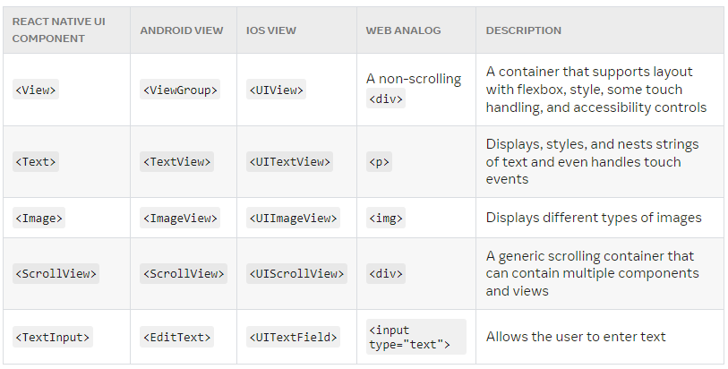

<br>

# **React Native 1**
### CS571: Building User Interfaces


<br>

#### Cole Nelson

---

### What will we learn today?

<div>

 - An Overview of Mobile Development
 - An Introduction to React Native
 - Programming w/ React Native & Expo

</div>

---

# Mobile Development
Native Development and its Alternatives

---

### What is "Native" Development?

Building specifically for the device (e.g. Android or iOS) that you want to support.

**iOS**: Objective-C or Swift w/ Cocoapods
**Android**: Java or Kotlin w/ Maven or Gradle

---

### Pros and Cons of Native Development

**Pros**

<div>

 - Organic User Experience
 - Optimized Apps
 - Fine-Grained Control

</div>

**Cons**

<div>

 - Expensive
 - Little Code Reuse
 - Less Sense of Abstraction

 </div>

---

### Alternatives to Native Development

**No mobile app!** Do we really need an app? Could a responsive webpage be just as effective?

**WebView!** Can we take our existing code and just slap it into a WebView? e.g. Apache Cordova

**Cross-Platform!** Can we use a library or framework that will make our code work natively on Android *and* iOS? e.g. React Native


---

### Who is using React Native?

<div>

 - Facebook
 - Microsoft
 - Shopify
 - Coinbase
 - Discord

</div>

[... among many others](https://reactnative.dev/showcase). Other companies may be doing pure-native or hybrid development.


---

# React Native
React for Mobile Devices!

---

<div class="center-info">




[React Native in 100 seconds](https://www.youtube.com/watch?v=gvkqT_Uoahw)

</div>

---

### What is React Native?

A JS framework for building native, cross-platform mobile applications using React, developed by Facebook in 2015.

Unlike ReactJS, which was a library, React Native is a framework that includes everything* that we will need to build mobile applications.

React Native supports iOS and Android development.

---


<br><br><br><br><br><br><br><br><br><br>

[Image Source](https://reactnative.dev/docs/intro-react-native-components)

---

### React Native


 - No more DOM or browser capabilities!
 - Connects with native components using a "bridge"

[Image Source](https://formidable.com/blog/2019/lean-core-part-4/)

---

### React Native


 - The use of a bridge causes a slight hit to performance.
 - Will soon be remedied with ["The  New Archeticture"](https://reactnative.dev/docs/the-new-architecture/landing-page) and Hermes!

[Image Source](https://formidable.com/blog/2019/lean-core-part-4/)

---

# React Native for React Devs
How can we write our mobile apps with React Native?

---

### Getting Started

Using [Expo](https://expo.dev/), similar to create-react-app!

Run one-time...

```bash
npm install expo-cli --global
```

Run for each project...

```
expo init my-new-project
cd my-new-project
npm start
```

---

### Getting Started: A Special Note

By default, expo uses "lan" to host your app. This may cause issues on certain networks. Try using "localhost" or "tunnel" by modifying scripts of `package.json`...

```bash
"scripts": {
  "start": "expo start --localhost",
  "android": "expo start --android",
  "ios": "expo start --ios",
  "web": "expo start --web"
}
```


---

# Expo Demo
Setting up your first React Native app!

Download Expo for [iOS](https://apps.apple.com/us/app/expo-go/id982107779) or [Android](https://play.google.com/store/apps/details?id=host.exp.exponent&gl=US).

---


### Good Questions to Ask...
 - Can we declaratively program using RN? **YES**
 - Can we use JSX with RN? **YES**
 - Can we use React hooks in RN? **YES**
 - Can we do styling in RN? **YES**-ish
 - Is it *truly* cross-platform? **MAYBE**-ish
 - Can we use cookies, sessionStorage, and localStorage in RN? **NO**

---



<br><br><br><br><br><br><br><br><br><br>

[Image Source](https://reactnative.dev/docs/intro-react-native-components)

---

### Hello World!

```javascript
import React from 'react';
import { Text, View } from 'react-native';

function MyApp() {
  return (
    <View style={{ flex: 1, justifyContent: "center", alignItems: "center" }}>
      <Text>
        Try editing me! 🎉
      </Text>
    </View>
  );
}

export default MyApp;
```

[Code Source](https://reactnative.dev/docs/0.69/getting-started)

---

### Styling

Because React Native does not use a "browser", we can't use CSS styles. Instead, we create JavaScript stylesheets.

```javascript
const styles = StyleSheet.create({
  container: {
    flex: 1,
    justifyContent: 'center',
    backgroundColor: '#ecf0f1',
    padding: 40,
  },
  ...
});
```

---

### Styling

Style definitions can be done inline or via stylesheets. You can also combine both methods.

```javascript
<View>
 <Text style={styles.label}>First label</Text>
 <Text style={{fontSize: 28, color:'tomato'}}>Second label</Text>
 <Text style={[styles.label, {fontSize: 20, color:'gray'}]}>Third label</Text>
</View>
```

[Snack Solution](https://snack.expo.dev/@ctnelson1997/styling)


---


---

### "Cross-Platform"

React Native provides a number of components that utilize platform capabilities that may not be available in other platforms, thus for cross-platform development, we need to utilize multiple platform-specific components.

e.g. `TouchableNativeFeedback` only works on Android; a *similar* effect can be achieved using `TouchableHighlight` on iOS.

---

### Differentiating by Platform

```javascript
if (Platform.OS === 'android') {
  return (
    <TouchableNativeFeedback> ... </TouchableNativeFeedback>
  );
} else {
  return (
    <TouchableHighlight> ... </TouchableHighlight>
  );
}
```

Optionally, create two components e.g. `MyButton.ios.js` and `MyButton.android.js.`

[Snack Solution](https://snack.expo.dev/@ctnelson1997/platform-specific-components-snack)

---

### Cross-Platform: Dimensions

Mobile devices vary significantly in screen size, and we o"en need to obtain screen dimensions of the device using the `Dimensions` class in `react-native`.

```javascript
getScreenSize = () => {
 const screenWidth = Math.round(Dimensions.get('window').width);
 const screenHeight = Math.round(Dimensions.get('window').height);
 return { screenWidth: screenWidth, screenHeight: screenHeight };
} 
```

---

# "Find My Badger" Demo
Everything that we learned in React... w/ React Native!

[Snack Solution](https://snack.expo.dev/@ctnelson1997/find-my-badgers)

---


### Homework
 - Much more open-ended!
 - Requires you to record a demo.
 - Start early!

---

### What did we learn today?

<div>

 - An Overview of Mobile Development
 - An Introduction to React Native
 - Programming w/ React Native & Expo

</div>

---

# On to Mobile Design! 🚀
