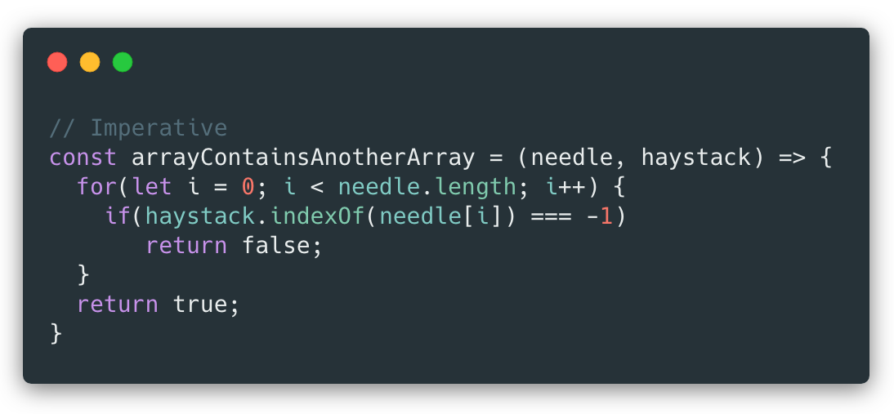
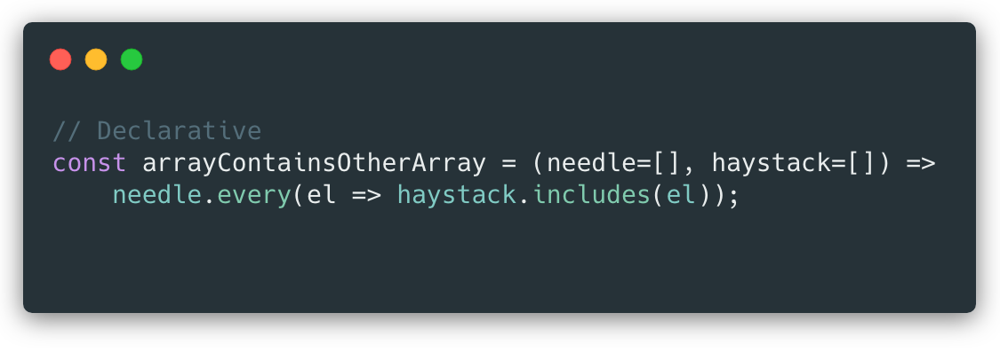

<br>

# **React Native 2**
### CS571: Building User Interfaces


<br>

#### Cole Nelson

---

### What will we learn today?

<div>

 - Imperative vs Declarative Programming
 - Review of Mobile App Development
 - Navigation in React Native
 - A Note on Expo

</div>

---

### An Intervention

Our code is getting !pretty messy...

What can we do?

[Big Ball of Mud](https://exceptionnotfound.net/big-ball-of-mud-the-daily-software-anti-pattern/)


---



[Image Source](https://dzone.com/articles/imperative-vs-declarative-javascript)


---



[Image Source](https://dzone.com/articles/imperative-vs-declarative-javascript)

---

# Nifty JS Array Functions!
`slice`, `concat`, `filter`, `some`, `every`, and `reduce`

---

### `slice` and `concat`

 - `slice` returns a shallow copy with an optional beginning (inclusive) and ending (exclusive) index.

 - `concat` joins two arrays together.

---

### `filter`, `some`, and `every`

Performs a callback function over each element.

 - `filter`: returns items where the callback function returns `true`

 - `some`: returns `true` if atleast one of the callback functions returns `true`

 - `every`: returns `true` if every one of the callback functions returns `true`

---

### `reduce`

Constructs an object, array, or value. An initial value is provided and updated on each iteration via a callback with (prev, curr) parameters.

```javascript
const array1 = [1, 2, 3, 4];
// 0 + 1 + 2 + 3 + 4
const initialValue = 0;
const sumWithInitial = array1.reduce(
  (prev, curr) => prev + curr, initialValue
);
console.log(sumWithInitial); // 10
```

Source: [MDN Docs](https://developer.mozilla.org/en-US/docs/Web/JavaScript/Reference/Global_Objects/Array/reduce)

---

### `reduce` Challenges

Construct an array of strings of the amount in dollars rounded to the nearest cent.

```javascript
const amounts = [1.928182, 29.10192, 3, 8.4, 0.12]
```

Construct an object where the key is the name of the word and the value is its number of letters.

```javascript
const words = ["react", "native", "is", "awesome"]
```

---

# Mobile Development
Native Development and its Alternatives

---

### What is "Native" Development?

Building specifically for the device (e.g. Android or iOS) that you want to support.

**iOS**: Objective-C or Swift w/ Cocoapods
**Android**: Java or Kotlin w/ Maven or Gradle

---

### Alternatives to Native Development

**No mobile app!** Do we really need an app? Could a responsive webpage be just as effective?

**WebView!** Can we take our existing code and just slap it into a WebView? e.g. Apache Cordova

**Cross-Platform!** Can we use a library or framework that will make our code work natively on Android *and* iOS? e.g. React Native


---

# HW6: Badger Bakery 🦡🍩
Did it feel like we were making a mobile app?

---


# HW7: Badger News 🦡📰
w/ React Navigation

---

# Navigation in React Native
A more mobile-centric library.

---

### React Navigation Alternatives

React Native is a framework* but still lacks support for things like navigation.

<div>

 - [React Navigation](https://reactnavigation.org/) new!
 - [React Router](https://reactrouter.com/en/main) on Week 4!
 - `return isHome ? <HomeScreen> : <SettingsScreen>`
 - Other outdated libraries...

</div>

---

### React Navigation Installation

Just a few dependencies...

```bash
npm install @react-navigation/native react-native-screens react-native-paper 
react-native-safe-area-context react-native-gesture-handler
react-native-reanimated  @react-navigation/native-stack 
@react-navigation/drawer @react-navigation/bottom-tabs
```

Beware of your auto-imports!

---

### React Navigation

We will use...

- Tab Navigation: `@react-navigation/bottom-tabs`
- Drawer Navigation: `@react-navigation/drawer`
- Stack Navigation: `@react-navigation/native-stack `


...others exist!

---

### Navigation Basics

<div>

 - Must be nested inside of a `NavigationContainer`
 - Create navigators via a function `createNAVIGATOR()` e.g. `createBottomTabNavigator()`
 - Navigators consist of a *navigator* and a set of *screens*

 ```javascript
<NavigationContainer>
  <SomeNav.Navigator>
    <SomeNav.Screen name="Bookstore" component={BookstoreScreen}/>
    <SomeNav.Screen name="Book" component={BookScreen}/>
  </SomeNav.Navigator>
</NavigationContainer>
 ```


</div>


---

### Navigation Basics

 - `useNavigation` is a custom React hook that can be used to help us navigate
   - Supports `navigate`, `reset`, `goBack` among others
 - Information can be passed from screen to screen via *route params* (see Native Stack Navigator example)
 - Navigators can be styled
 - Navigators can be nested

---

### Tab Navigation

```javascript
const SocialTabs = createBottomTabNavigator();

<NavigationContainer>
  <SocialTabs.Navigator>
    <SocialTabs.Screen name="NewsFeed" component={NewsFeedScreen}/>
    <SocialTabs.Screen name="Notifications" component={NotificationScreen}/>
    <SocialTabs.Screen name="AboutMe" component={AboutMeScreen} />
  </SocialTabs.Navigator>
</NavigationContainer>
```

[Expo Snack Solution](https://snack.expo.dev/@ctnelson1997/tab-navigation)

---

### Drawer Navigation

```javascript
const SocialDrawer = createBottomTabNavigator();

<NavigationContainer>
  <SocialDrawer.Navigator>
    <SocialDrawer.Screen name="NewsFeed" component={NewsFeedScreen}/>
    <SocialDrawer.Screen name="Notifications" component={NotificationScreen}/>
    <SocialDrawer.Screen name="AboutMe" component={AboutMeScreen} />
  </SocialDrawer.Navigator>
</NavigationContainer>
```

[Expo Snack Solution](https://snack.expo.dev/@ctnelson1997/drawer-navigation)

---

### Stack Navigation

```javascript
const BookStack = createNativeStackNavigator();

<NavigationContainer>
  <BookStack.Navigator>
    <BookStack.Screen name="Bookstore" component={BookstoreScreen}/>
    <BookStack.Screen name="Book" component={BookScreen}/>
  </BookStack.Navigator>
</NavigationContainer>
```

[Expo Snack Solution](https://snack.expo.dev/@ctnelson1997/stack-navigation)

---

### Stack Navigation

Can push a screen onto the history stack via `navigation.push(screenName, params)`
 - `screenName` is the name of the screen to navigate to, e.g. `Book`
 - `params` is an optional object of parameters to pass to the receiving screen.
 - `params` is recieved  as `props.route.params`

---

### In-Class Example
Pass and receive params while navigating.

---

### Nested Navigation

<div>

 - Navigators can be nested.
   - Stack in Tabs (e.g. HW7)
   - Stack in Drawer
   - Stack in Tabs in Drawer (e.g. Example Below)
   - Stack in Stack in Tabs
   - Stack in Stack in Stack in Stack in Stack
 - Make use of the `headerShown` option!

</div>

[Expo Snack Solution](https://snack.expo.dev/@ctnelson1997/nested-navigation)

---

### A Note on Expo

Expo is a library for quickly getting started with React Native projects. No need to...

<div>

 - cocoa pods install ❌
 - maven/gradle building ❌
 - react native linking ❌

</div>

You may need to use specific expo libraries, such as [@expo/vector-icons](https://docs.expo.dev/guides/icons/)

---

### What did we learn today?

<div>

 - Imperative vs Declarative Programming
 - Review of Mobile App Development
 - Navigation in React Native
 - A Note on Expo

</div>

---

# On to Design Patterns! 🚀
